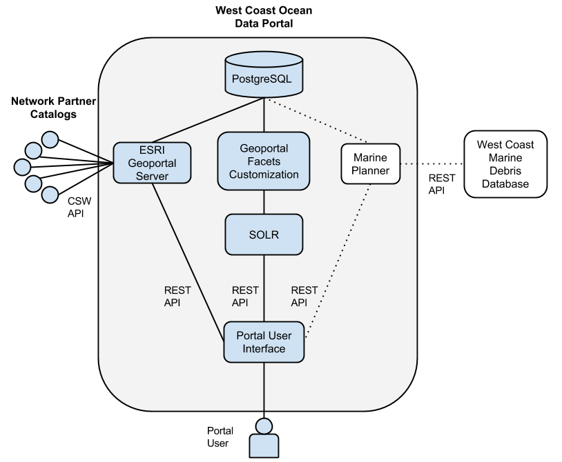

==============
Our Technology
==============
The following sections describe the technology and architecture behind the West Coast Ocean Data Portal (WCODP).  It is not necessary to understand this information in order to contribute to the portal, but may be of interest to developers, technologists, and those who  update, maintain, or troubleshoot the WCODP. 

Architecture
============
The West Coast Ocean Data Portal is comprised of a number of technologies and software components.  The following diagram shows a generalized view of the software architecture.

**The WCODP relies upon the following technologies:**

`Nginx`_
	HTTP server and reverse proxy

`Apache Tomcat 6`_
	Java web server.  Tomcat is particularly good for Java-based apps like Geoportal, but is flexible enough to handle most of the other apps as well.

`WCGA Data Portal UI`_
	WCODP front-end -- mostly JavaScript and HTML.  The HTML is generated using Jekyll. The JavaScript includes AngularJS, Bootstrap, JQuery, and several other building blocks.  This static site pulls data from Geoportal Server and Solr to display the contents and information stored in the Portal

`ESRI Geoportal Server`_ 
	An open source geo-data catalog.  It allows for the entry or collection (‘harvesting’) of metadata files. Using these metadata files, Geoportal Server can organize, search, and display all if the information in meaningful, human-readable ways. We are also using the “collections” feature of Geoportal Server to define custom categories and issues, and assign those as attributes of the records we have harvested. This way we can organize the data according to categories that we have determined and applied ourselves, categories that are not defined in the metadata.

`Solr`_
	Solr is a tool used to aid in the quick searching of large amounts of data. It takes specific attributes of the data, and keeps track of which records shared that attribute, so that when it is requested, it doesn’t have to search every record: it already knows. Technically, that work is already done by a software called Lucene, and it is installed with Geoportal Server. Solr is built on top of Lucene and allows for faceted searches. The most visible result of which is the numeric indicator of how many records will match your query if you add specific filters (like the categories or issues).

GFC 
	Geoportal Facet Customizations.  This custom tool was built by ESRI for us specifically to handle some of our needs that were not met by the basic Geoportal Server software. Namely, this is the piece that gets our custom-defined categories and issues indexed by Solr for faceted searches, and exposes the harvest source of each record to Solr as well. As of this writing, it does not yet, but may soon also facilitate in searching which records were harvested from a given source.

`PostgreSQL`_/`PostGIS`_
	PostgreSQL is a nice database for moderate to heavy traffic websites. It is fast and powerful. PostGIS is built on top of PostgreSQL to handle geographic queries, which Geoportal Server relies on to search by location, bounding box, etc…

`Munin`_
	Monitoring software. This tool visualizes the status of the server hardware.

.. _Nginx: http://wiki.nginx.org/Main
.. _Apache Tomcat 6: https://tomcat.apache.org/index.html
.. _WCGA Data Portal UI: https://github.com/Ecotrust/wc-data-registry
.. _ESRI Geoportal Server: https://github.com/Esri/geoportal-server
.. _Solr: http://lucene.apache.org/solr/
.. _PostgreSQL: http://www.postgresql.org/
.. _PostGIS: http://postgis.net/
.. _Munin: http://munin-monitoring.org/

.. seealso::

	Background on the selection of technologies for the West Coast Ocean Data Portal
		`WCGA RDF Data Registry Design Assessement <http://www.westcoastoceans.org/media/data_network_act/wcga_rdf_data_registry_design_assessment_2013.pdf>`_

Registration / Harvest Process
==============================

Additional Resources
====================
Github Repository
Management Guide -- TODD, suggest protecting this (at Google end) because there are passwords in the doc.
Anything Else?

