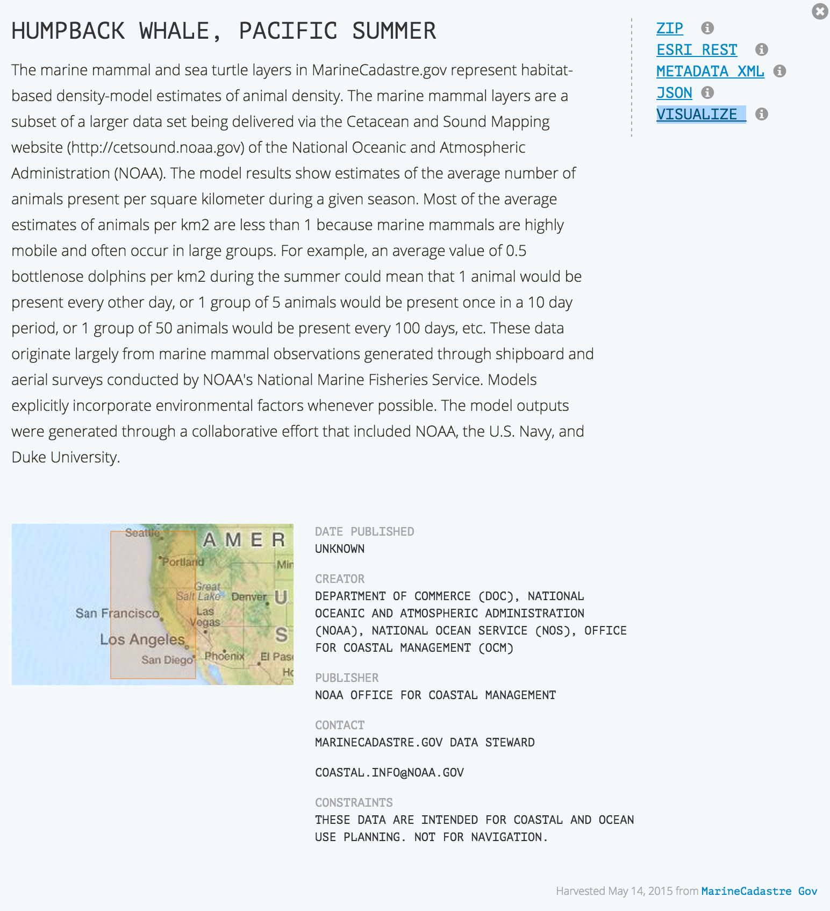

============
Web Services
============

What are Web Services?
======================

A Web service is a method of communication between two electronic devices over a network. It is a software function provided at a network address over the Web with the service always on as in the concept of utility computing. The W3C defines a Web service generally as, "a software system designed to support interoperable machine-to-machine interaction over a network." (from `Wikipedia <https://en.wikipedia.org/wiki/Web_service>`_) 

For the WCODP and this knowledge base, we are most interested in web mapping services and catalog services.  Web mapping services are web services that allow us to view, query, and manipulate or process geospatial maps and/or data.   Catalog services, which are described in the `next section`_, are for publishing and searching metadata.

.. _Catalog services: ../catalogs/catalogs.html
.. _next section: ../catalogs/catalogs.html

Why Create Web Services?
========================

Web services provide an open interoperable and highly efficient framework for using distributed data resources in common systems.  A web mapping service published by a single data provider, can be used simultaneously by many different users and applications, both web and desktop applications.

Web mapping services give the publisher control over how the data are displayed and the types of capabilities that the end-user can access, such as query, edit, geoprocess, download, etc.  Publishing a web mapping service facilitates end-user access to the most current and authoritative data because the web service address (URL) remains unchanged, while data supporting the service can be modified and updated.   

In the West Coast Ocean Data Portal (WCODP), web mapping services are used to facilitate data discovery by allowing end-users to preview and visualize the data on a map.   

For example, if you selected the `VISUALIZE`_ link in the example WCODP record above, it would display the associated web mapping service in the WCODP map viewer. 

.. _VISUALIZE: http://maps.westcoastoceans.org/visualize/#humpback-whale-pacific-summer

Types of Web Mapping Services
=============================

Web mapping services comprise a lot of  different kinds of services, including:

	* mapping services - to get a map image
	* data services - to get coordinates of map features or attributes about the features
	* geocoding or address matching services - to get a coordinate for an address
	* geoprocessing services - to get information about feature services or to modify those shapes

.. sidebar:: Web Mapping Service versus Web Map Service (WMS)

	The terminology is a bit confusing because Web Map Service (WMS) refers specifically to the Open Geospatial Consortium (OGC) `WMS interface standard`_.  However, some people or software vendors may use the term as a generic description of  web services for geospatial data.   For this knowledge base, when we are referring to geospatial web services in general, we will use the term *web mapping services*.  

	.. _WMS interface standard: http://www.opengeospatial.org/standards/wms

The Open Geospatial Consortium (OGC) provides a variety of open source standards for web mapping services which have been broadly adopted by the geospatial community.  Some of the commonly used standards are listed below. 

	* A Web Map Service (`WMS`_) defines an interface that allows a client to get maps of geospatial data and gain detailed information on specific features.
	* A Web Feature Service (`WFS`_) allows a client to perform data manipulation operations on one or more geographic features.  WFS offers direct fine-grained access to geographic information at the feature and feature property level.
	* A Web Processing Service (`WPS`_) provides access to calculations or models which operate on spatially referenced data.
	* A Web Map Tile Service (`WMTS`_) provides access to cartographic maps of geo-referenced data.  WMTS is commonly used for base maps.
	* A Web Coverage Service (`WCS`_) defines a standard interface and operations that enable interoperable access to geospatial coverages consisting of intact, raw data.  WCS is commonly used with multidimensional or raster data.

Some additional OGC standards (data formats and services) include: `KML`_, Sensor Observation Service (`SOS`_), `GeoPackage`_, `NetCDF`_, and Catalogue Service (`CSW`_). 

.. _WMS: http://www.opengeospatial.org/standards/wms
.. _WFS: http://www.opengeospatial.org/standards/wfs
.. _WPS: http://www.opengeospatial.org/standards/wps
.. _WMTS: http://www.opengeospatial.org/standards/wmts
.. _WCS: http://www.opengeospatial.org/standards/wcs
.. _KML: http://www.opengeospatial.org/standards/kml
.. _SOS: http://www.opengeospatial.org/standards/sos
.. _GeoPackage: http://www.opengeospatial.org/standards/geopackage
.. _NetCDF: http://www.opengeospatial.org/standards/netcdf
.. _CSW: http://www.opengeospatial.org/standards/cat

ESRI has its own proprietary web mapping services that are usually referred to as ArcGIS REST or ESRI REST services, and can be accessed via the `ArcGIS REST API`_. The ArcGIS REST services have similar capabilities to the OGC services, including, 

	* `Map Service`_
	* `Feature Service`_
	* `Geoprocessing Service`_
	* `Image Service`_

.. _ARCGIS REST API: http://resources.arcgis.com/en/help/arcgis-rest-api/index.html#/The_ArcGIS_REST_API
.. _Map Service: http://server.arcgis.com/en/server/latest/publish-services/windows/what-is-a-map-service.htm
.. _Feature Service: http://server.arcgis.com/en/server/latest/publish-services/windows/what-is-a-feature-service-.htm
.. _Geoprocessing Service: http://server.arcgis.com/en/server/latest/publish-services/windows/what-is-a-geoprocessing-service-.htm
.. _Image Service: http://server.arcgis.com/en/server/latest/publish-services/windows/key-concepts-for-image-services.htm

.. seealso::
	
	Geospatial Standards and Operational Policies (Natural Resources Canada)
		http://www.nrcan.gc.ca/earth-sciences/geomatics/canadas-spatial-data-infrastructure/8902

How to Create Web Mapping Services
==================================

There are a variety of software packages or mapping engines that can be used to create web mapping services.

	* `ArcGIS for Server`_ can produce ArcGIS REST services and some OGC services, including WMS, WFS, WPS, WMTS, and WCS.
	* `ArcGIS Online`_ can also be used to create two types of ArcGIS REST Services, called `hosted layers`_.   However, the capabilities of these services are more limited than the analogous service created by ArcGIS for Server.
	* `Geoserver`_ produces OGC-standard WMS, WCS, WFS, WMTS, WPS, and CSW services.
	* `Mapserver`_ also produces OCG-standard services, including, WMS, WCS, WFS, and SOS

.. _ArcGIS for Server: http://server.arcgis.com/en/
.. _ArcGIS Online: https://doc.arcgis.com/en/arcgis-online/
.. _hosted layers: https://doc.arcgis.com/en/arcgis-online/share-maps/hosted-web-layers.htm
.. _Geoserver: http://geoserver.org/
.. _Mapserver: http://mapserver.org/index.html

Best Practices for Creating Services
====================================

* Where possible provide OGC and sector/vendor-specific services to ensure maximum interoperability with a variety of systems.
	* Any data that is served from an ArcGIS for Server as Esri REST services can be easily also served as OGC services without a lot of secondary effort, simply by ‘enabling’ OGC services in the ArcGIS for Server settings. Whenever possible/practical, both options should be enabled as best practice.
* Web services should specify the version and last update date for the source data, as well as link to the source metadata.
* In order to support the broadest range of user needs, from casual users viewing data through web browser to desktop .NET developers, web services should provide both REST and SOAP-based services.
* Use a map server that supports all OCG standards applicable to the project objectives, preferably WMS, WMTS, and WFS at a minimum. GeoServer and ArcGIS for Server provide two popular options.
* If developing a slippy map, render and serve all data that does not require frequent update as cached tiles, in compliance with the WMTS standard. GeoWebCache, which extends GeoServer, is a popular tile server.
* If serving a single map image or data that requires frequent update but not feature queries, provide a standards-compliant WMS.
* If serving data with individual features that may be queried or changed by the client, provide a standards-compliant WFS.
* If providing multiple data sources and/or services to the public, also provide a CSW with ISO-compliant metadata for each service.

Publishing Great Web Services
-----------------------------

Anna Verrill gave an excellent presentation about publishing great web services at the 2014 West Coast Ocean Data Network Meeting.  

`Publishing Great Web Services Presentation Slides <http://network.westcoastoceans.org/wp-content/uploads/2014/11/WCGA-Network-Meeting-Web-Services-Traning-Session.pdf>`_ 

Publishing Great Web Services Presentation Videos:
	1. `Intro and Data Management (5:03) <https://www.youtube.com/watch?v=PSNHXclEEMU>`_
	2. `Map Preparation (8:25) <https://www.youtube.com/watch?v=2GUcCWgc9vY>`_
	3. `Web Services Overview (2:56) <https://www.youtube.com/watch?v=Aa-BXU9q2kA>`_
	4. `Best Practices (3:51) <https://www.youtube.com/watch?v=tG4b0gn3mQg>`_
	5. `Conclusion (1:57) <https://www.youtube.com/watch?v=WcolSkenxoY>`_

Projection/Coordinate System
----------------------------

The base maps for most web mapping applications use the Web Mercator projection, `EPSG:3857`_.  Although web mapping services can be projected on-the-fly to match the base map, your mapping service will have the best performance if all the layers are in the same projection.  Therefore, it is recommended to use Web Mercator (EPSG:3857) for your web mapping services.  In ArcGIS software, it is referred to as WGS 1984 Web Mercator (Auxiliary Sphere).

.. _EPSG:3857: https://en.wikipedia.org/wiki/Web_Mercator#EPSG:3857

Cartography
-----------

Cartographic advice for web services goes here.

Additional Resources
--------------------

	* `Tools and Best Practices for Coastal Web Maps <http://www.northlandia.com/pdf/coastalwebmaps.pdf>`_
	* Authoring web maps using ArcGIS/ESRI products:
		* `Map Authoring Considerations - ArcMap <http://desktop.arcgis.com/en/desktop/latest/map/publish-map-services/map-authoring-considerations.htm>`_
		* `Authoring Content for Web Maps - ArcGIS <http://resources.arcgis.com/en/communities/mapping/home/017w0000000z000000.htm>`_
		* `ArcGIS Online Best Practices for Layers <http://doc.arcgis.com/en/arcgis-online/reference/best-practices-layers.htm>`_
		* `Best Practices for Designing Effective Map Services (video) <http://video.esri.com/watch/2602/best-practices-for-designing-effective-map-services>`_
